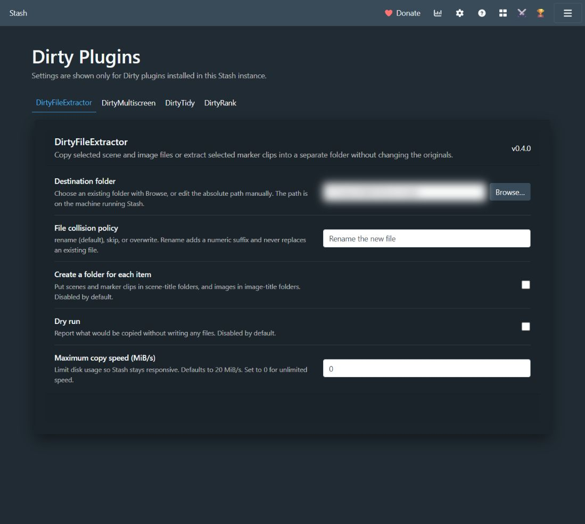
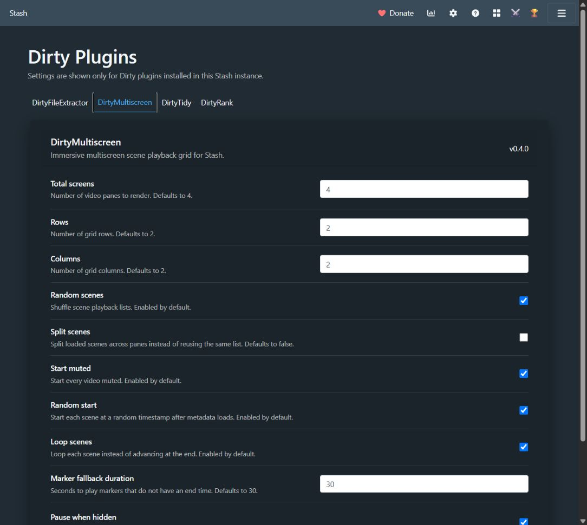
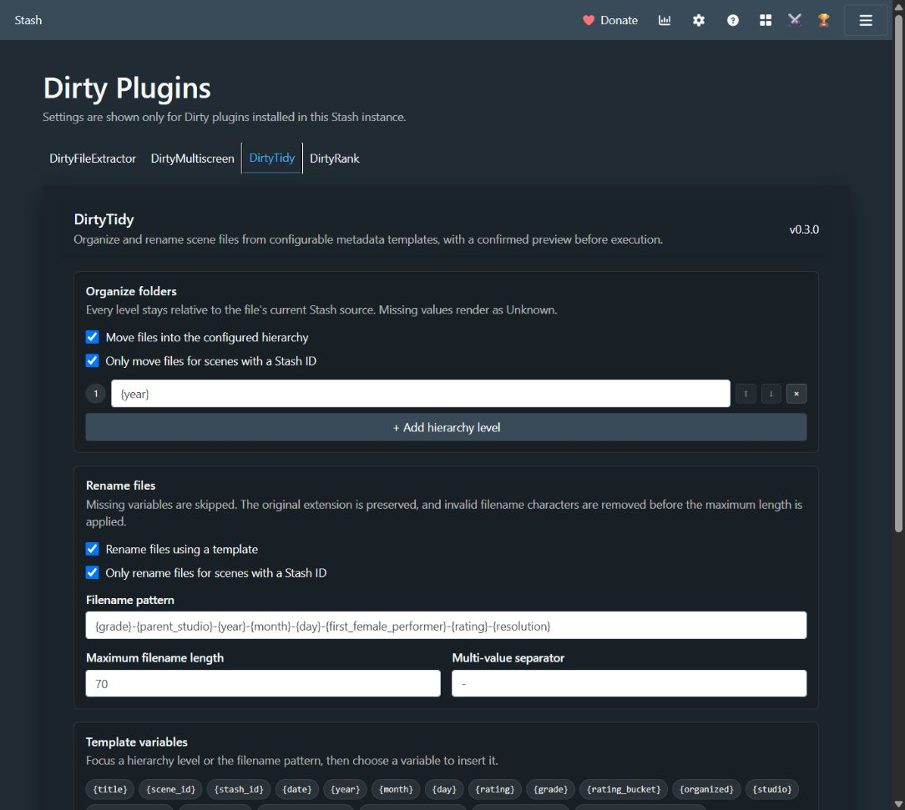

# Dirty Plugins

Dirty Plugins is a collection of integrated plugins for
[Stash](https://stashapp.cc/). The suite adds safe media extraction,
multiscreen playback, performer ranking, and preview-first file organization.

All plugins share the hidden **DirtyPlugins** runtime and settings hub. The hub
keeps their interfaces consistent, stores settings and high-frequency data in
a shared SQLite database, and is installed automatically as a dependency.

## Included plugins

| Plugin | What it does | Version |
| --- | --- | ---: |
| [DirtyStats](plugins/DirtyStats/) | Explores origins, growth, ages, ratings, studios, birthdays and cast connections with native filters and PNG export. | 0.6.15 |
| [DirtyFileExtractor](plugins/DirtyFileExtractor/) | Copies selected scene or image files and extracts selected markers as precisely bounded MP4 clips without changing the originals. | 0.4.3 |
| [DirtyMultiscreen](plugins/DirtyMultiscreen/) | Plays scenes or markers in a configurable, immersive multi-pane grid. | 0.4.4 |
| [DirtyRank](plugins/DirtyRank/) | Ranks performers through category-based comparisons using high-precision Glicko-2 ratings, adaptive matchmaking, Gauntlet battles, and leaderboards. | 0.7.16 |
| [DirtyTidy](plugins/DirtyTidy/) | Previews and applies metadata-driven folder and filename organization through Stash's native file-moving API. | 0.3.8 |

The plugins share rounded controls, aligned selects and actions, visible focus
and save feedback, and graphite/teal/amber default styling. Optional DirtyStats
themes keep their own colours while using the same control geometry. Native
Stash cards, filters, and playback controls keep the host theme. Synthetic
review pages are in [`tests/fixtures/`](tests/fixtures/).

## Features

### DirtyFileExtractor

- Adds extraction actions to selected scenes, markers, and images.
- Copies original scene and image files without moving or modifying them.
- Uses FFmpeg to extract each marker's exact start/end range as an MP4 clip.
- Supports optional item folders, dry runs, copy-speed limits, and `rename`,
  `skip`, or `overwrite` collision handling.
- Runs as a Stash background task with per-file logs and byte-level progress.
- Includes a server-side folder picker. In Docker, it shows the container
  filesystem, so the destination must be a writable bind-mounted path.

#### DirtyFileExtractor settings



Choose the destination, collision policy, folder layout, dry-run behavior, and
copy-speed limit from one focused panel. The machine-specific path is blurred
only in this documentation capture.

### DirtyMultiscreen

- Launches from scene and marker lists, selections, performer pages, and other
  supported Stash contexts.
- Configures the number of screens and grid rows/columns.
- Supports ordered or random playback, split scene lists, random start points,
  looping, start-muted playback, and pausing while the tab is hidden.
- Plays bounded markers and applies a configurable duration when a marker has
  no end time.

#### DirtyMultiscreen playback


The edge-to-edge grid above is a real four-pane session. Only the video frames
are blurred for the public repository.

#### DirtyMultiscreen settings



Set the screen count and geometry, then choose how scenes are distributed,
started, looped, muted, and paused.

### DirtyRank

- Maintains independent rating pools and configurable weighted categories for
  each enabled performer sex.
- Calculates weighted overall ratings and adds **Overall Elo** to Stash's
  performer sorting options.
- Uses Glicko-2 rating, deviation, and volatility with full floating-point
  precision and no normal rating ceiling.
- Uses expected-information-gain matchmaking to reduce the number of battles
  needed for a useful ordering.
- Reports **Provisional**, **Refined**, and **Excellent** precision, category
  confidence, coverage, and estimated battles remaining.
- Advances immediately after a vote while persistence and multiple undos run
  through an ordered background queue.
- Supports left/right selection, ties, skips, keyboard shortcuts, repeated
  undos, and category-specific standings beside the current battle.
- Provides a focused **Gauntlet** mode from performer pages.
- Can play a curated marker for either performer during a battle. It chooses a
  marker from the highest-rated scene containing markers and falls back to the
  performer's highest-rated complete scene.
- Includes category and overall leaderboards, confidence statistics, paginated
  table/gallery views, and a gold/silver/bronze podium.
- Stores ratings and battle history outside Stash performer fields, avoiding
  performer-update hooks and remaining compatible with Advanced Rating.

#### DirtyRank battles


Each vote stays focused on one category and two performers, with instant visual
feedback, live category standings, and an estimate of the work remaining.

#### DirtyRank leaderboards


The top three receive a distinctive podium, while the standings retain rating,
deviation, battle count, win-loss-draw record, and precision.

#### DirtyRank settings


Configure performer pools, presentation, confidence goals, weighted categories,
exports, and advanced Glicko-2 controls.

### DirtyTidy

- Builds folder hierarchies and filenames from scene metadata templates.
- Supports title, dates, rating/grade, studio, performers, tags, Stash IDs,
  resolution, duration, source filename, and other variables.
- Shows the complete plan before changing files, including ready, warning,
  blocked, and unchanged operations.
- Never overwrites an existing destination and keeps files inside their current
  configured Stash source.
- Can restrict moving and renaming independently to scenes with external Stash
  IDs.
- Runs manually or after completed Scan/Generate jobs once a strategy has been
  previewed, confirmed, and explicitly approved.

DirtyTidy deliberately keeps its confirmation workflow because its settings
can move and rename files. Other Dirty Plugin settings save automatically after
a control changes.

#### DirtyTidy settings



Build the hierarchy and filename templates, insert metadata variables, select
an automation trigger, and preview the complete plan before approving changes.

## Installation from Stash

The recommended installation method is the published package source.

1. Open **Settings → Plugins → Available Plugins** in Stash.
2. Add this package-source URL:

   ```text
   https://dirtyground3.github.io/dirty-plugins/main/index.yml
   ```

3. Reload the available plugin packages.
4. Install any of **DirtyFileExtractor**, **DirtyMultiscreen**, **DirtyRank**,
   **DirtyTidy**, or **DirtyStats**.
5. Reload the Stash page after installation or an update.

The source URL must end in `index.yml`; the GitHub repository URL is not a
Stash package source. **DirtyPlugins** is pulled in automatically when a plugin
declares it as a dependency—there is normally no need to install the hub
separately.

### Initial configuration

Open **Settings → Plugins**, expand an installed Dirty plugin, and select its
link to the shared Dirty Plugins settings page.

- **DirtyFileExtractor:** choose an absolute destination directory on the
  machine or container running Stash.
- **DirtyMultiscreen:** choose the desired pane count and playback defaults.
- **DirtyRank:** select participating performer sexes, categories, weights, and
  the desired confidence goal. The crossed-swords and trophy buttons open
  Battles and Leaderboards.
- **DirtyTidy:** configure a folder/filename strategy, generate a preview,
  review it, then use **Confirm and save** before running or enabling automation.
- **DirtyStats:** open the Prairie Grid icon (red, blue, and yellow tiles) in the utility navigation to explore
  performer origins, scene growth, ages, ratings, performer birthdays, or cast
  connections, apply native filters, and export the displayed visualization as PNG.

## Manual installation

1. Download the complete directory for the desired plugin and the sibling
   [`plugins/DirtyPlugins`](plugins/DirtyPlugins/) directory.
2. Copy both directories into the Stash plugin directory:

   - Windows: `%USERPROFILE%\.stash\plugins`
   - Linux/macOS: `~/.stash/plugins`
   - Docker: the plugins directory mounted inside the Stash container

3. Keep the directory names and their contents unchanged.
4. In Stash, open **Settings → Plugins** and select **Reload Plugins**.
5. Refresh the Stash browser page.

The Python-backed plugins require Python 3.9 or newer in the environment where
Stash runs. DirtyFileExtractor also uses Stash's configured FFmpeg executable.

## Updating

Reload the package list from **Available Plugins** and install the offered
updates. Runtime SQLite databases, WAL files, and backups are excluded from
plugin packages, so ordinary package updates do not replace them. Back up the
shared database from DirtyRank's **Options** section before major manual
changes.

## Data and settings

The hidden DirtyPlugins hub owns `dirty_plugins.sqlite3` in its installed plugin
directory. It stores settings for all managed plugins and DirtyRank's rating
pools and battle journal. The database uses WAL mode for responsive concurrent
reads and writes.

Standard settings save automatically after a short debounce and serialized
writes prevent an older request from overwriting a newer value. DirtyTidy is
the intentional exception: file-moving and renaming strategies require a fresh
preview and confirmation.

## Debugging plugin activity

All Dirty plugins share a browser-side debug log so you can see exactly what
each plugin does on ordinary Stash pages. It is written to the browser console
with a `[DirtyPlugins]` prefix and kept in memory at
`window.__dirtyPluginsDebugLog`. Each entry names the plugin, the hook
(`patch.before`, `patch.after`, `patch.instead`, `register.route`, a GraphQL
request, or a lifecycle event), the current path, and elapsed milliseconds.

Open the browser developer tools (F12) on the Stash tab and filter the console
for `DirtyPlugins`. To dump the whole collected log, including entries from
before the console was opened, run:

```js
dirtyPluginsDumpDebugLogs()
```

The same function is available as `DirtyPlugins.dumpDebugLogs()`.

Console output can be silenced without losing the in-memory log:

```js
window.__dirtyPluginsDebug = false;             // this page only
localStorage.setItem("dirtyPluginsDebug", "0"); // persists
```

If Stash is stuck on "Loading plugins…", the last `script started` line with no
matching `script finished registering` identifies the plugin whose script never
finished loading.

> Stash's **Troubleshooting mode** disables all plugins and custom JavaScript,
> and only raises the *server* log level. Dirty plugin logs therefore do not
> appear while it is active. Exit Troubleshooting mode (which reloads Stash),
> hard-refresh the tab (Ctrl+F5), and check the browser console instead.

### Server-side logs

The Python backends log through Stash's plugin log protocol, so their output
appears in Stash's own log with a `[Plugin / DirtyPlugins]`,
`[Plugin / DirtyRank]`, `[Plugin / DirtyTidy]`, `[Plugin / DirtyStats]`, or
`[Plugin / DirtyFileExtractor]` prefix. Every backend logs a `started` line and
a `finished` line (with the operation mode and elapsed milliseconds), and logs
failures. A `started` line with no matching `finished` line identifies a backend
call that hung.

To see these, keep plugins enabled and set **Settings → General → Log level** to
`Debug` (or at least `Info`), then open **Settings → Logs**. This is separate
from the browser-console log above. Note that Stash does not log the plugin
asset requests themselves; to see whether the server is slow to return a
`/plugin/<id>/javascript` bundle, use the browser's **Network** tab and watch
that request while Stash is stuck on "Loading plugins…".

## Screenshots and content safety

DirtyRank battle and leaderboard pages may display adult performer images or
video frames. Any screenshot contributed to this repository must fully blur,
pixelate, or cover every performer image, thumbnail, video frame, and other
potentially explicit media region **before it is committed**. Cropping alone is
not sufficient when another visible region may contain adult media.

Safe screenshots of the settings hub are preferred. Store future images under
`docs/images/`, use descriptive filenames and alt text, and keep uncensored
captures outside the repository and its Git history.

## Repository layout

```text
plugins/
├── DirtyPlugins/        # shared UI, GraphQL helpers, settings and SQLite owner
├── DirtyFileExtractor/  # selection UI and Python extraction backend
├── DirtyMultiscreen/    # multiscreen playback UI
├── DirtyRank/           # battle/leaderboard UI and Glicko-2 backend
├── DirtyStats/          # interactive library statistics and visualizations
└── DirtyTidy/           # preview UI and file-organization backend
tests/                   # Python, JavaScript, and shared UI contracts
build_site.sh            # builds the GitHub Pages package source
```

## Development and publishing

Run the test suite from the repository root:

```powershell
python -B -m unittest discover -s tests -v
node --check plugins/DirtyRank/dirtyRank.js
node --check plugins/DirtyPlugins/dirtyPlugins.js
node tests/test_dirty_ui_pilot.js
node tests/test_dirty_rank_algorithms.js
node tests/test_dirty_rank_media.js
node tests/test_dirty_rank_registration.js
node tests/test_dirty_tidy_automation.js
node tests/test_dirty_tidy_settings.js
node tests/test_dirty_stats.js
node tests/test_dirty_stats_dashboard.js
node tests/test_dirty_multiscreen.js
```

Build the package source locally on a system with Bash and `zip`:

```bash
./build_site.sh _site/main
```

Pushes to `main` that affect plugins or packaging publish the following GitHub
Pages layout through GitHub Actions:

```text
main/
├── index.yml
├── dirtyPlugins.zip
├── extractScenes.zip
├── multiscreen.zip
├── dirtyRank.zip
├── dirtyStats.zip
└── dirtyTidy.zip
```

## License

This repository and its plugins are distributed under the [MIT License](LICENSE):

- [DirtyPlugins](plugins/DirtyPlugins/LICENSE)
- [DirtyFileExtractor](plugins/DirtyFileExtractor/LICENSE)
- [DirtyMultiscreen](plugins/DirtyMultiscreen/LICENSE)
- [DirtyRank](plugins/DirtyRank/LICENSE)
- [DirtyStats](plugins/DirtyStats/LICENSE)
- [DirtyTidy](plugins/DirtyTidy/LICENSE)
