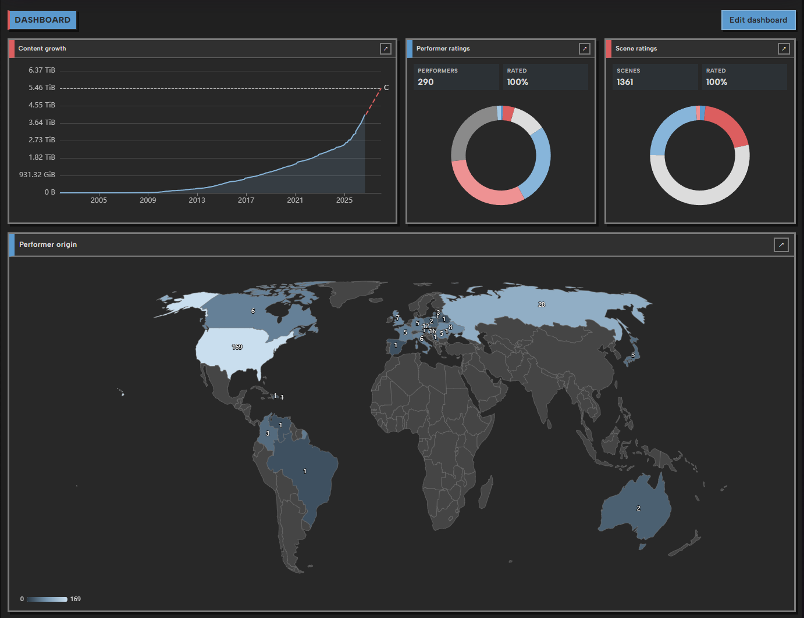
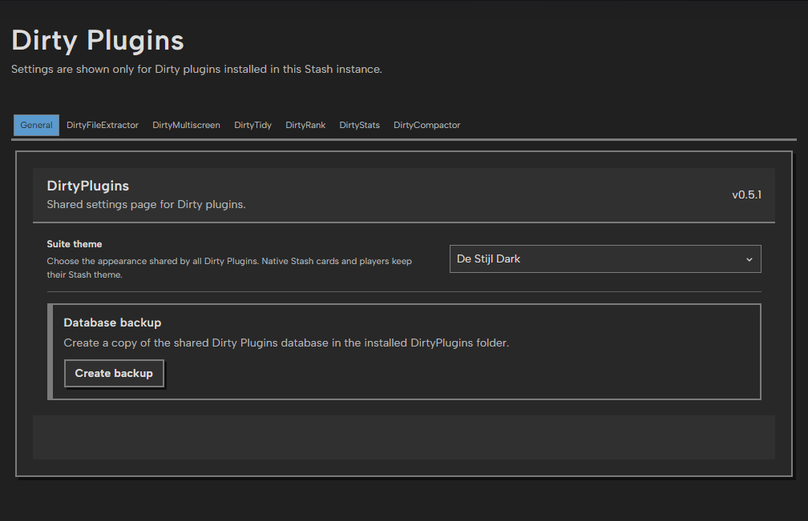
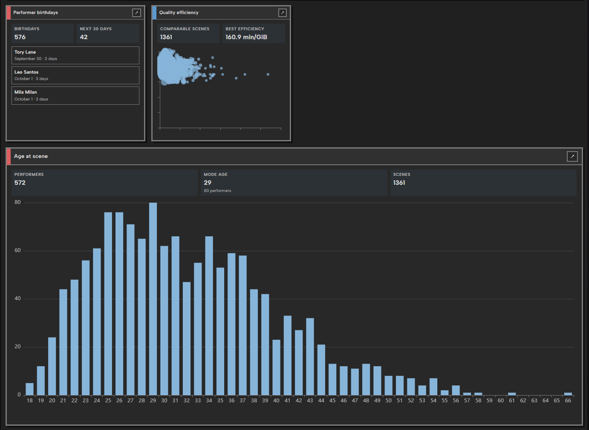
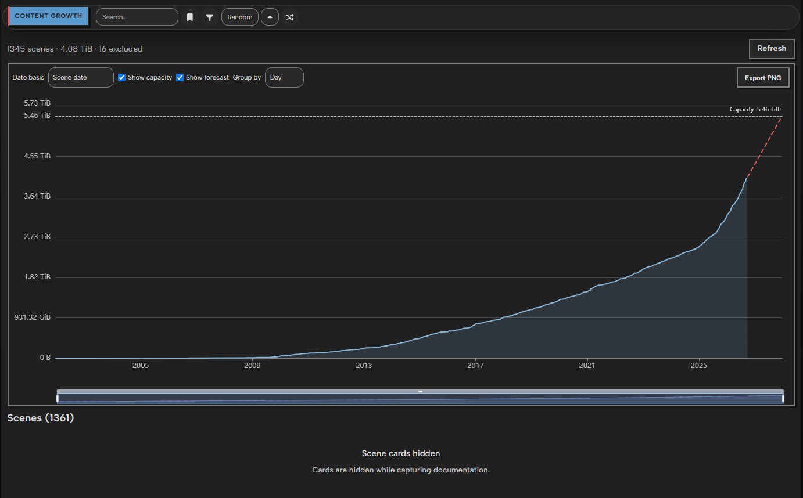
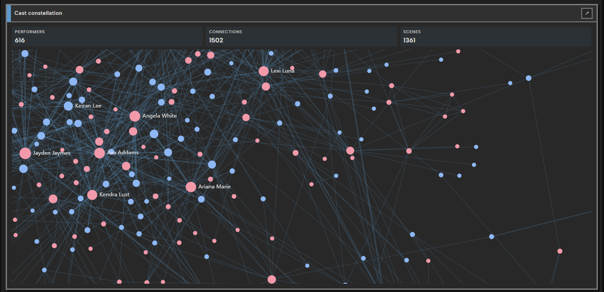
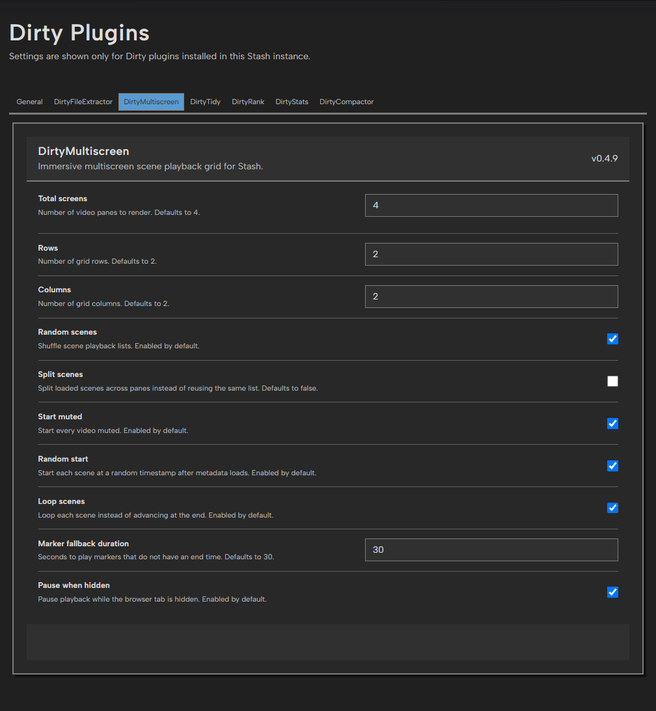
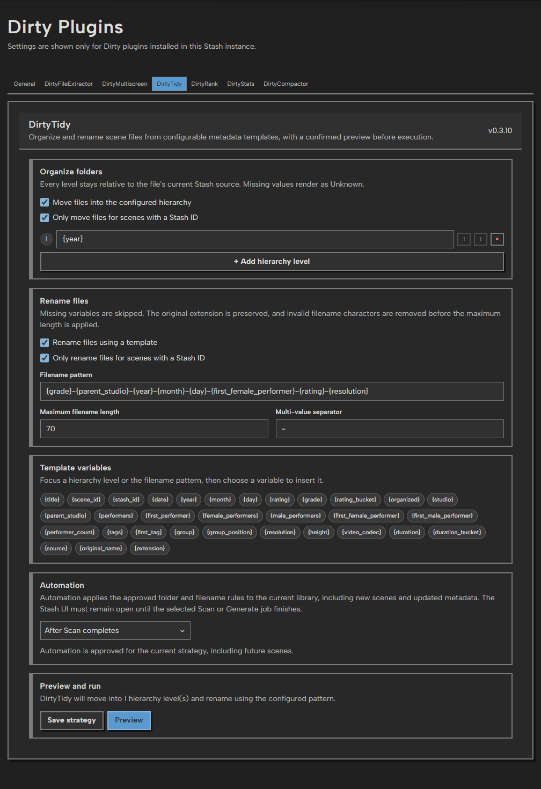
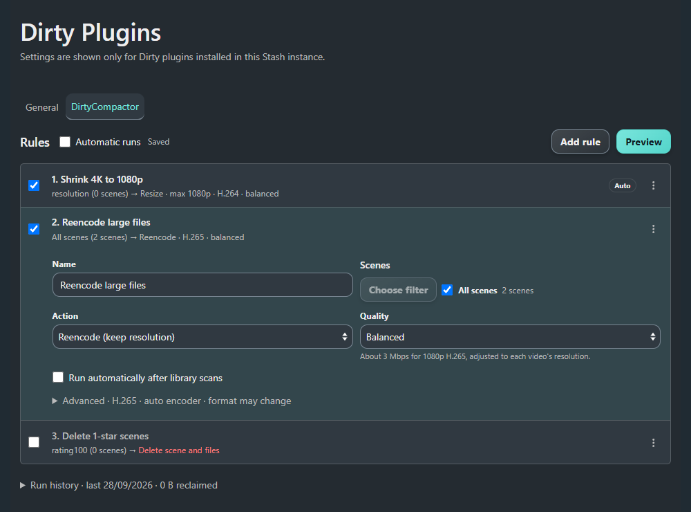

# Dirty Plugins

Dirty Plugins is a collection of integrated plugins for
[Stash](https://stashapp.cc/). The suite adds a statistics dashboard, safe
media extraction, multiscreen playback, performer ranking, preview-first file
organization, and rule-based space reclamation.

All plugins share the hidden **DirtyPlugins** runtime and settings hub. The hub
keeps their interfaces consistent, stores settings and high-frequency data in
a shared SQLite database, and is installed automatically as a dependency.



## Included plugins

| Plugin | What it does | Version |
| --- | --- | ---: |
| [DirtyStats](plugins/DirtyStats/) | A customizable dashboard plus full views for origins, growth, ages, ratings, viewing concentration, efficiency, studios, tags, birthdays and cast connections, with native filters and PNG export. | 0.6.41 |
| [DirtyRank](plugins/DirtyRank/) | Ranks performers in gender boxes through category battles using high-precision Glicko-2 ratings, adaptive matchmaking, Gauntlet and King of the hill modes, and leaderboards. | 0.7.68 |
| [DirtyMultiscreen](plugins/DirtyMultiscreen/) | Plays scenes or markers in a configurable, immersive multi-pane grid. | 0.4.9 |
| [DirtyFileExtractor](plugins/DirtyFileExtractor/) | Copies selected scene or image files and extracts selected markers as precisely bounded MP4 clips without changing the originals. | 0.4.6 |
| [DirtyTidy](plugins/DirtyTidy/) | Previews and applies metadata-driven folder and filename organization through Stash's native file-moving API. | 0.3.10 |
| [DirtyCompactor](plugins/DirtyCompactor/) | Reclaims space with ordered scene-filter rules that resize, reencode, or delete, with optional review of each encoded output before replacement. | 0.1.2 |
| [DirtyPlugins](plugins/DirtyPlugins/) | Unlisted shared runtime, settings hub, suite theme, and database owner. Installed automatically. | 0.5.1 |

## Shared look and settings

Every plugin uses the same rounded controls, aligned selects and actions,
visible focus, and pending/saving/saved/error feedback. Choose one **Suite
theme** in the DirtyPlugins **General** tab: Midnight (the default), Retro
Arcade, Candy Pop, Tropical Punch, Paper Picnic, De Stijl, or De Stijl Dark. It
styles all suite-owned surfaces; native Stash cards, filters, and players keep
the host theme. The same tab creates a backup of the shared database.



The screenshots in this README use the De Stijl Dark suite theme. Synthetic
review pages for the shared controls are in [`tests/fixtures/`](tests/fixtures/).

## Features

### DirtyStats

- Opens from the Prairie Grid icon (red, blue, and yellow tiles) in Stash's
  utility navigation.
- A customizable **Dashboard**: add any statistic (more than once if you like),
  drag to reorder, rename, choose Small, Medium, or Large, and give each widget
  its own native scene or performer filters. Layout and options save
  automatically.
- Full views for **Performer origin**, **Content growth**, **Age at scene**,
  **Scene ratings**, **Performer ratings**, **Performer cards**, **Rating vs
  scenes**, **Count vs rating**, **Repeat-offender curve**, **Quality
  efficiency**, **Studio value map**, **Tag DNA**, **Cast constellation**, and
  **Performer birthdays**.
- Reuses Stash's native filter blocks, saved filters, and scene/performer cards.
  Filters run on the server; clicking a chart element narrows the cards below.
- Content growth adds source-volume capacity, a forecast, and period selection.
- Every chart exports as PNG. ECharts and the world map are bundled locally, so
  no metadata leaves the machine.

#### DirtyStats dashboard widgets



Small and large widgets side by side: upcoming birthdays, quality efficiency,
and the age-at-scene histogram with its summary metrics.

#### DirtyStats full views



Content growth with the native scene filter bar, capacity line, and forecast.
Scene cards below the chart are replaced by a placeholder in capture mode.



The cast constellation links performers who share scenes; node size follows
scene count and colour follows gender.

### DirtyRank

- **Gender boxes**: each box selects a group of genders and has its own
  weighted categories and rating pools.
- Glicko-2 rating, deviation, and volatility with full floating-point precision,
  configurable evidence per battle, and four rating presets (Default, Chess,
  Confident, and Extremely confident).
- Expected-information-gain matchmaking towards a selectable confidence goal:
  every rating, complete leaderboard order, or a top N.
- Votes, ties, skips, up to 25 undos, and arrow-key controls. Battles advance
  immediately while persistence runs through an ordered background queue.
- **Gauntlet** mode from any performer page and a **King of the hill** mode
  in which the winner climbs the standings against fresh challengers.
- Optional scene playback below each card, preferring a curated marker and
  falling back to the performer's highest-rated scene.
- Leaderboards per category plus a weighted **Overall** score (Simple weighted
  or Power mean), featuring a **Podium**, **Mount Rushmore**, or **Fingers**
  display above gallery or table standings. Native performer filters and search
  narrow the results without changing global ranks.
- Adds an **Overall score** option to Stash's performer sort.
- Stores ratings and battle history outside Stash performer fields, avoiding
  performer-update hooks and remaining compatible with Advanced Rating.

#### DirtyRank battles


Native performer cards are the vote targets; the previews below them play each
performer's top-rated scene. All media is blurred for the repository.

#### DirtyRank leaderboards


The overall leaderboard with the Mount Rushmore display. Hover a score to see
each category's rank and rating.

#### DirtyRank settings


Configure gender boxes, navigation buttons, leaderboard and battle
presentation, the confidence goal, overall scoring, categories, and advanced
Glicko-2 parameters. Every change saves automatically.

### DirtyMultiscreen

- Launches from scene and marker lists, selections, performer and studio pages,
  and other supported Stash contexts, preserving the active list order.
- Configures the number of screens and grid rows/columns.
- Supports ordered or random playback, split scene lists, random start points,
  looping, start-muted playback, and pausing while the tab is hidden.
- Plays bounded markers and applies a configurable duration when a marker has
  no end time.
- Each pane has an O-counter button that counts once per playback session.

#### DirtyMultiscreen playback


A real edge-to-edge four-pane session. Video frames and titles are blurred for
the public repository.

#### DirtyMultiscreen settings



Set the screen count and geometry, then choose how scenes are distributed,
started, looped, muted, and paused.

### DirtyFileExtractor

- Adds **Extract selected…** to the selection actions menu for scenes, markers,
  and images, including performer scene tabs.
- Copies original scene and image files without moving or modifying them.
- Uses FFmpeg to extract each marker's exact start/end range as an MP4 clip.
- Supports optional item folders, dry runs, copy-speed limits, and `rename`,
  `skip`, or `overwrite` collision handling.
- Runs as a Stash background task with per-file logs and byte-level progress.
- Includes a server-side folder picker. In Docker, it shows the container
  filesystem, so the destination must be a writable bind-mounted path.

#### DirtyFileExtractor settings


The machine-specific destination path is blurred only in this documentation
capture.

### DirtyTidy

- Builds folder hierarchies and filenames from scene metadata templates.
- Supports title, dates, rating/grade, studio, performers, tags, Stash IDs,
  resolution, duration, source filename, and other variables.
- Shows the complete plan before changing files, filterable by ready, warning,
  blocked, and unchanged operations.
- Never overwrites an existing destination and keeps files inside their current
  configured Stash source.
- Can restrict moving and renaming independently to scenes with external Stash
  IDs.
- Runs manually or after completed Scan/Generate jobs once a strategy has been
  previewed, confirmed, and explicitly approved.

DirtyTidy deliberately keeps its confirmation workflow because its settings
can move and rename files. Other Dirty Plugin settings save automatically after
a control changes.

#### DirtyTidy settings



Build the hierarchy and filename templates, insert metadata variables, select
an automation trigger, and preview the complete plan before approving changes.

### DirtyCompactor

- Ordered rules, each with a native Stash scene filter (or **All scenes**) and
  one action: **Resize**, **Reencode**, or **Delete**. The first enabled
  matching rule wins.
- **Quality presets** (High, Balanced, Smallest files) pick a bitrate for each
  file from its resolution; a custom bitrate is still available. H.264 or
  H.265 with automatic NVIDIA NVENC, Intel QSV, or AMD AMF acceleration that
  falls back to CPU.
- **Preview** plans the run as a background task and estimates savings
  before anything changes.
- Optional per-file **output review**: play or download the actual encoded
  file, then accept it, discard it, or decide later. Originals stay untouched
  until accepted.
- Manual runs, or automatic runs after a successful Scan, with cancellation,
  recovery journals, and **Restore original** after an interrupted run.

#### DirtyCompactor rules



Each rule combines a scene filter with an action and its encoding options.
Rules autosave; new rules start disabled and Manual.

## Installation from Stash

The recommended installation method is the published package source.

1. Open **Settings → Plugins → Available Plugins** in Stash.
2. Add this package-source URL:

   ```text
   https://dirtyground3.github.io/dirty-plugins/main/index.yml
   ```

3. Reload the available plugin packages.
4. Install any of **DirtyStats**, **DirtyRank**, **DirtyMultiscreen**,
   **DirtyFileExtractor**, **DirtyTidy**, or **DirtyCompactor**.
5. Reload the Stash page after installation or an update.

The source URL must end in `index.yml`; the GitHub repository URL is not a
Stash package source. **DirtyPlugins** is pulled in automatically when a plugin
declares it as a dependency—there is normally no need to install the hub
separately.

### Initial configuration

Open **Settings → Plugins**, expand an installed Dirty plugin, and select its
link to the shared Dirty Plugins settings page. Each installed plugin has its
own tab there.

- **General:** choose the suite theme and create database backups.
- **DirtyStats:** no settings are needed. Open the Prairie Grid icon in the
  utility navigation and choose **Edit dashboard** to arrange your widgets.
- **DirtyRank:** set up gender boxes, their categories and weights, and the
  desired confidence goal. The crossed-swords and trophy buttons open Battles
  and Leaderboards.
- **DirtyMultiscreen:** choose the desired pane count and playback defaults.
- **DirtyFileExtractor:** choose an absolute destination directory on the
  machine or container running Stash.
- **DirtyTidy:** configure a folder/filename strategy, generate a preview,
  review it, then use **Confirm and save** before running or enabling automation.
- **DirtyCompactor:** add a rule, choose its scenes, action, and quality
  preset, then **Preview** before the first run.

## Manual installation

1. Download the complete directory for the desired plugin and the sibling
   [`plugins/DirtyPlugins`](plugins/DirtyPlugins/) directory.
2. Copy both directories into the Stash plugin directory:

   - Windows: `%USERPROFILE%\.stash\plugins`
   - Linux/macOS: `~/.stash/plugins`
   - Docker: the plugins directory mounted inside the Stash container

3. Keep the directory names and their contents unchanged.
4. In Stash, open **Settings → Plugins** and select **Reload Plugins**.
5. Refresh the Stash browser page.

The Python-backed plugins require Python 3.9 or newer in the environment where
Stash runs; no Python packages are needed. DirtyFileExtractor uses Stash's
configured FFmpeg executable, and DirtyCompactor needs Stash 0.31.1 or newer
with FFmpeg and FFprobe.

## Updating

Reload the package list from **Available Plugins** and install the offered
updates. Runtime SQLite databases, WAL files, and backups are excluded from
plugin packages, so ordinary package updates do not replace them. Back up the
shared database with **Create backup** in the DirtyPlugins **General** tab
before major manual changes.

## Data and settings

The hidden DirtyPlugins hub owns `dirty_plugins.sqlite3` in its installed plugin
directory. It stores settings for all managed plugins, the DirtyStats dashboard
layout, DirtyRank's rating pools and battle journal, and DirtyCompactor's rules,
run snapshots, and recovery journals. The database uses WAL mode for responsive
concurrent reads and writes.

Standard settings save automatically after a short debounce and serialized
writes prevent an older request from overwriting a newer value. DirtyTidy is
the intentional exception: file-moving and renaming strategies require a fresh
preview and confirmation.

## Debugging plugin activity

All Dirty plugins share a browser-side debug log so you can see exactly what
each plugin does on ordinary Stash pages. Console logging is off by default;
when enabled, messages have a `[DirtyPlugins]` prefix. The log is kept in memory at
`window.__dirtyPluginsDebugLog`. Each entry names the plugin, the hook
(`patch.before`, `patch.after`, `patch.instead`, `register.route`, a GraphQL
request, or a lifecycle event), the current path, and elapsed milliseconds.

Open the browser developer tools (F12) on the Stash tab. To dump the whole
collected log, including entries from
before the console was opened, run:

```js
dirtyPluginsDumpDebugLogs()
```

The same function is available as `DirtyPlugins.dumpDebugLogs()`.

Enable console output when troubleshooting:

```js
window.__dirtyPluginsDebug = true;              // this page only
localStorage.setItem("dirtyPluginsDebug", "1"); // persists
```

Filter the console for `DirtyPlugins`. Disable console output again with:

```js
window.__dirtyPluginsDebug = false;             // this page only
localStorage.setItem("dirtyPluginsDebug", "0"); // persists
```

If Stash is stuck on "Loading plugins…", the last `script started` line with no
matching `script finished registering` identifies the plugin whose script never
finished loading.

> Stash's **Troubleshooting mode** disables all plugins and custom JavaScript,
> and only raises the *server* log level. Dirty plugin logs therefore do not
> appear while it is active. Exit Troubleshooting mode (which reloads Stash),
> hard-refresh the tab (Ctrl+F5), and check the browser console instead.

### Server-side logs

The Python backends log through Stash's plugin log protocol, so their output
appears in Stash's own log with a `[Plugin / DirtyPlugins]`,
`[Plugin / DirtyRank]`, `[Plugin / DirtyTidy]`, `[Plugin / DirtyStats]`,
`[Plugin / DirtyCompactor]`, or `[Plugin / DirtyFileExtractor]` prefix. Every
backend logs a `started` line and a `finished` line (with the operation mode and
elapsed milliseconds), and logs failures. A `started` line with no matching
`finished` line identifies a backend call that hung.

To see these, keep plugins enabled and set **Settings → General → Log level** to
`Debug` (or at least `Info`), then open **Settings → Logs**. This is separate
from the browser-console log above. Note that Stash does not log the plugin
asset requests themselves; to see whether the server is slow to return a
`/plugin/<id>/javascript` bundle, use the browser's **Network** tab and watch
that request while Stash is stuck on "Loading plugins…".

## Screenshots and content safety

DirtyRank, DirtyMultiscreen, and DirtyStats pages may display adult performer
images, scene titles, or video frames. Any screenshot contributed to this
repository must fully blur, pixelate, or cover every performer image,
thumbnail, video frame, and other potentially explicit media region **before it
is committed**. Cropping alone is not sufficient when another visible region
may contain adult media.

Append `?docsCapture=1` to a suite page to replace native cards, media, and
private paths with placeholders, and inspect every image anyway. Store images
under `docs/images/`, use descriptive filenames and alt text, and keep
uncensored captures outside the repository and its Git history.

## Repository layout

```text
plugins/
├── DirtyPlugins/        # shared UI, GraphQL helpers, settings and SQLite owner
├── DirtyCompactor/      # compaction rules UI and FFmpeg backend
├── DirtyFileExtractor/  # selection UI and Python extraction backend
├── DirtyMultiscreen/    # multiscreen playback UI
├── DirtyRank/           # battle/leaderboard UI and Glicko-2 backend
├── DirtyStats/          # dashboard, statistics and visualizations
└── DirtyTidy/           # preview UI and file-organization backend
tests/                   # Python, JavaScript, and shared UI contracts
build_site.sh            # builds the GitHub Pages package source
docs/images/             # censored screenshots used by the documentation
```

## Development and publishing

Run the test suite from the repository root:

```powershell
python -B -m unittest discover -s tests -v
npm ci
npm run typecheck
node tests/test_plugin_assets.js
node --check plugins/DirtyRank/dirtyRank.js
node --check plugins/DirtyPlugins/dirtyPlugins.js
node --check plugins/DirtyMultiscreen/multiscreen.js
node tests/test_dirty_ui_pilot.js
node tests/test_dirty_compactor.js
node tests/test_dirty_file_extractor_ui.js
node tests/test_dirty_theme.js
node tests/test_dirty_rank_algorithms.js
node tests/test_dirty_rank_media.js
node tests/test_dirty_rank_registration.js
node tests/test_dirty_tidy_automation.js
node tests/test_dirty_tidy_settings.js
node tests/test_dirty_stats.js
node tests/test_dirty_stats_dashboard.js
node tests/test_dirty_stats_contrast.js
node tests/test_dirty_multiscreen.js
```

TypeScript checks annotated JavaScript and emits no files. Plugin assets remain
plain JavaScript loaded directly in the order listed by each manifest, and
React templates use the shared `DirtyPlugins.react.html` tag instead of a build
step. Python backends keep one Stash entry script and import local helper
modules.

Build the package source locally on a system with Bash and `zip`:

```bash
./build_site.sh _site/main
```

Pushes to `main` that affect plugins or packaging publish the following GitHub
Pages layout through GitHub Actions:

```text
main/
├── index.yml
├── dirtyPlugins.zip
├── dirtyCompactor.zip
├── extractScenes.zip
├── multiscreen.zip
├── dirtyRank.zip
├── dirtyStats.zip
└── dirtyTidy.zip
```

## License

This repository and its plugins are distributed under the [MIT License](LICENSE):

- [DirtyPlugins](plugins/DirtyPlugins/LICENSE)
- [DirtyCompactor](plugins/DirtyCompactor/LICENSE)
- [DirtyFileExtractor](plugins/DirtyFileExtractor/LICENSE)
- [DirtyMultiscreen](plugins/DirtyMultiscreen/LICENSE)
- [DirtyRank](plugins/DirtyRank/LICENSE)
- [DirtyStats](plugins/DirtyStats/LICENSE)
- [DirtyTidy](plugins/DirtyTidy/LICENSE)
