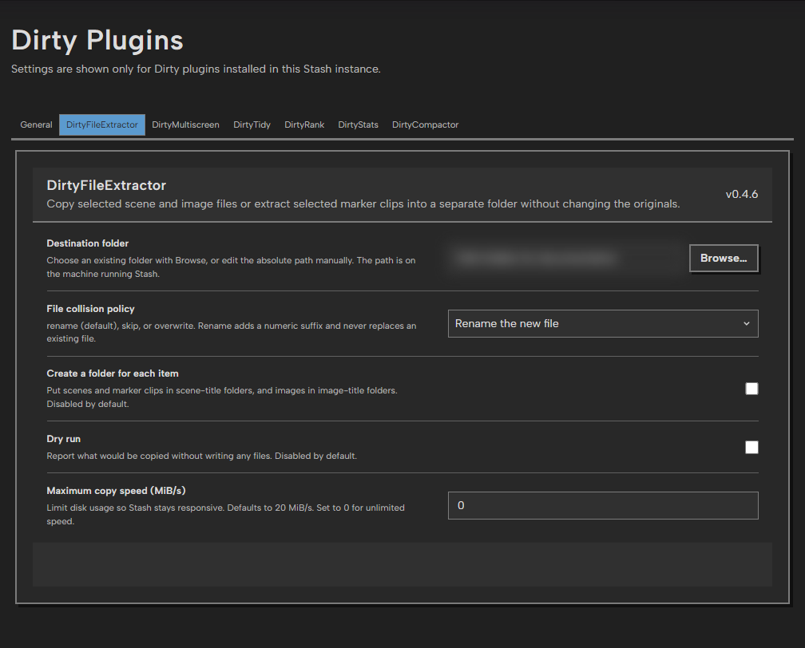

# DirtyFileExtractor

DirtyFileExtractor is a Stash plugin that copies media from selected scenes,
markers, or images into a separate folder. It does not move, rename, or modify
the originals.

## Features

- **Extract selected…** appears in the selected-list **…** actions menu when
  one or more scenes, markers, or images are selected. It does not move the
  scene grid or the existing toolbar controls. The toolbar keeps its original
  width during selection so its left edge does not jump.
- Scene selections on performer pages also show the extraction action.
- Scenes copy every attached media file.
- Markers extract only their `seconds` to `end_seconds` range from the parent
  scene. Each selected marker produces its own accurately bounded MP4 clip
  through FFmpeg, including when several markers belong to the same scene.
- Images copy their original visual files.
- Optional title-based subfolders for scenes and images. Marker files use the
  parent scene's title.
- Collision policies: `rename` (safe default), `skip`, and `overwrite`.
- Optional dry-run mode.
- Live per-file log messages and byte-level progress in Stash's Tasks view.
- Selection actions use the native lists' selection state and the shared button
  component, preserving Stash's existing controls and selected items across pages.
- Copy speed defaults to 20 MiB/s to avoid monopolizing the disk used by Stash;
  set **Maximum copy speed** to `0` for unlimited throughput.
- Uses only the Python standard library and Stash's configured FFmpeg; no
  additional packages need to be installed.

## Screenshot



The shared settings panel controls the destination, collision policy, optional
folders, dry runs, and copy-speed limit. The machine-specific destination is
blurred only in this documentation capture.

## Installation

1. Copy this entire directory into Stash's plugin directory. The usual paths
   are `%USERPROFILE%\.stash\plugins\DirtyFileExtractor` on Windows and
   `~/.stash/plugins/DirtyFileExtractor` on Linux/macOS.
2. Copy the sibling **DirtyPlugins** directory into the same plugins directory.
3. In Stash, open **Settings > Plugins** and click **Reload Plugins**.
4. Expand **DirtyFileExtractor**, follow its settings link, and set
   **Destination folder** to an absolute path on
   the machine running Stash.
5. Ensure `python` on that machine runs Python 3.9 or newer.

For Docker, the destination must be a path *inside the Stash container*. Bind
mount the host export directory into the container, then enter that container
path in the plugin setting. The mounted directory must be writable by the user
running Stash.

Use **Browse…** beside **Destination folder** on the shared settings page to navigate directories exposed
by the Stash server and save the selected path. The standard **Edit** button is
still available for entering a path manually. In Docker, the picker shows the
container filesystem rather than host-only paths.

## Usage

Open Stash's **Scenes**, **Markers**, **Images**, or a performer's **Scenes** tab and select one or more
items using the normal checkboxes. Open the **…** actions menu and choose
**Extract selected…**.
Stash runs copying as a background job; progress and errors appear
under **Tasks** and in the Stash log.

For scenes, the plugin copies every attached media file. For markers, it writes
one MP4 containing only the selected marker interval. For images, it copies the
original visual files. It does not copy generated previews, screenshots,
sprites, or unrelated sidecars.

## Collision behavior

- `rename` (default): keep the existing destination file and copy as
  `filename (2).ext`, `filename (3).ext`, and so on.
- `skip`: leave the existing destination file and skip that source.
- `overwrite`: replace the existing destination file.

Values other than these three are rejected.

## Development

Run the local checks from the repository root:

```powershell
python -B -m unittest discover -s tests -v
node --check plugins/DirtyFileExtractor/extractScenes.js
node tests/test_dirty_file_extractor_ui.js
```

The UI integration adds a React action row to Stash's scene, marker, and image
lists through `PluginApi.patch.after`. It uses DirtyPlugins for GraphQL,
database-backed settings, notifications, and shared visuals. Reloading tears
down the previous instance so older patches pass the native list through.
The folder picker is attached to `document.body` and registered as a shared
settings field action.
The folder picker uses the shared button style, keeps keyboard focus inside
until closed, restores focus to its opener, and locks background scrolling.
With `?docsCapture=1`, folder and path labels use synthetic placeholders.

## License

DirtyFileExtractor is distributed under the [MIT License](LICENSE).
