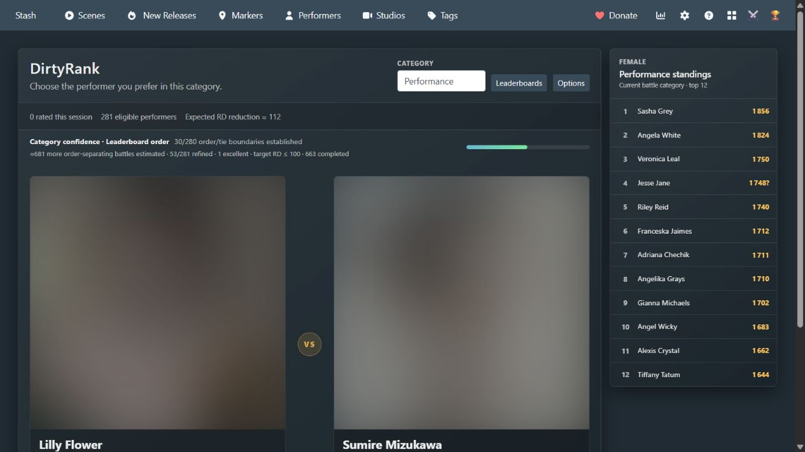
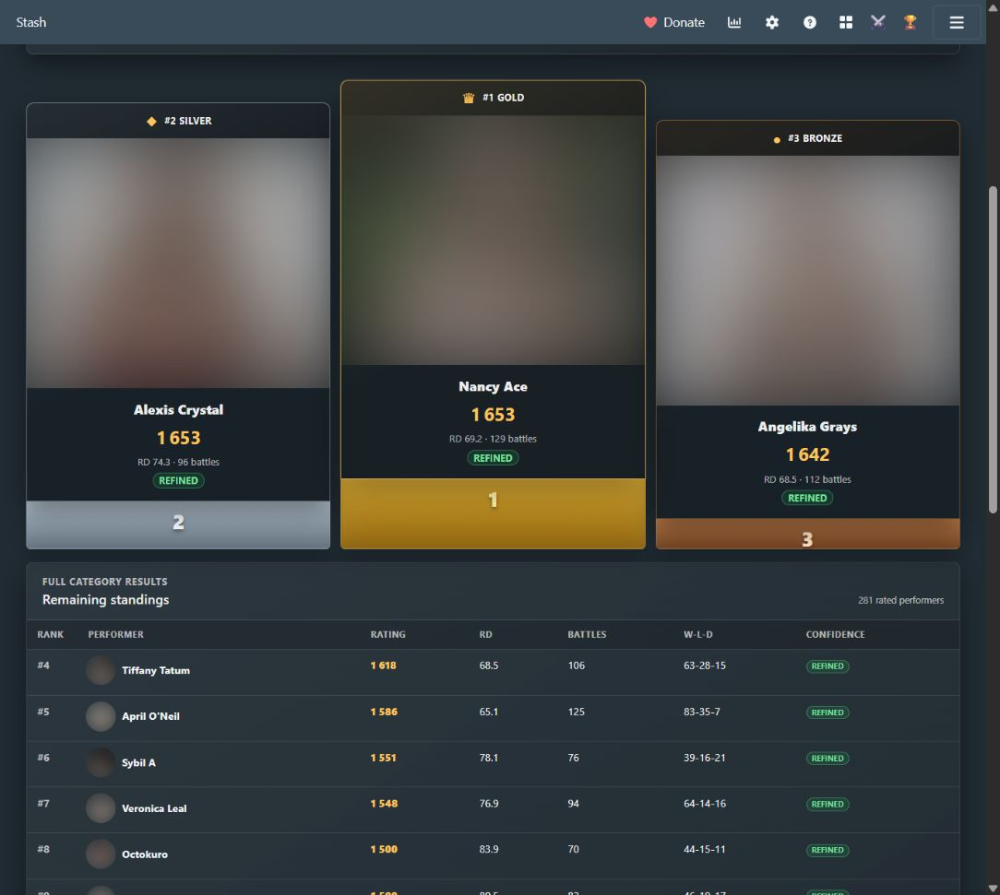
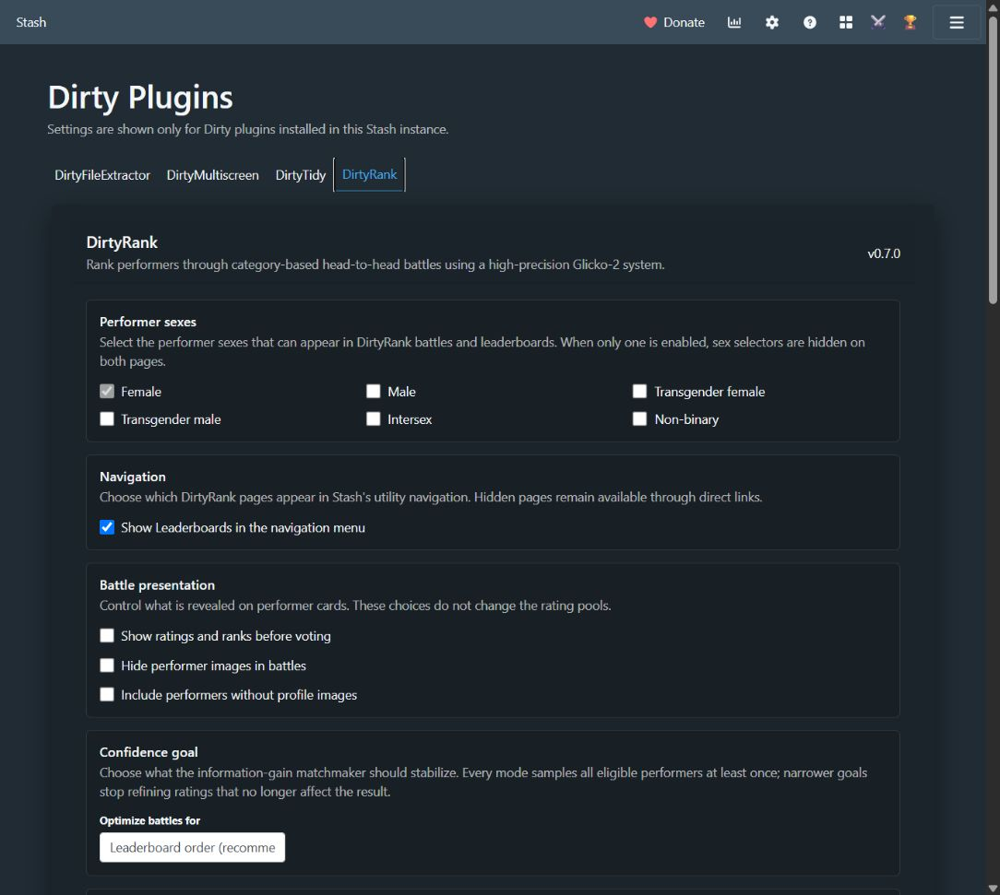

# DirtyRank

DirtyRank ranks Stash performers through head-to-head battles. It uses Glicko-2,
so every category and performer cohort tracks a rating, rating deviation, and
volatility instead of relying on a capped integer score.

## Features

- Standings gallery and podium use Stash's native performer cards, so installed
  themes and performer-card customizations apply automatically. DirtyRank scores
  and ranks appear separately below the cards; the cards keep their Stash ratings.
- Battles and Gauntlet also use native cards. Click the photo to vote; native
  card buttons and profile links keep their normal actions. Scene players remain
  separate below the cards. Hiding performer images also hides the native card.

- Independent rating pools and configurable category sets for each Stash
  performer sex.
- The battle page remembers the explicitly selected category for each performer
  sex, including across page reloads, and changes it only if that category is
  disabled or removed.
- Settings choose exactly which performer sexes participate in battles and
  leaderboards. A sex selector appears on those pages only when more than one
  sex is enabled. Rating-category settings are shown only for enabled sexes,
  and their sex selector is hidden when only one sex is enabled.
- Every performer sex starts with Appearance and Performance categories.
  Categories have a weight, and the overall leaderboard is calculated as the
  weighted average of their Glicko-2 ratings.
- High-precision ratings with no normal upper ceiling; the default starting
  rating is 1000.
- Configurable evidence per battle defaults to 2.0, reflecting that subjective
  comparisons are expected to be more repeatable than a chess result. It
  doubles the Glicko-2 information contribution without duplicating match totals.
- Provisional ratings based on rating deviation. Inactivity does not alter a
  performer's rating or uncertainty.
- Expected-information-gain matchmaking that predicts each candidate battle's
  Glicko-2 uncertainty reduction, applies soft recent-pair and calibration
  penalties, and advances the selected confidence goal as efficiently as possible.
- Selectable confidence goals for every performer rating, complete leaderboard
  order, or a configurable top N. Leaderboard modes stop refining performers
  once they no longer affect the requested ordering.
- Distinct **Tie** and **Skip** actions. A tie is rated; a skip does not change
  either performer.
- Each battle card can load media on demand. It prefers a curated marker from
  the performer's highest-rated scene that has markers, then falls back to the
  performer's highest-rated full Stash scene.
- Enable **Automatically play top scenes** under **Battle presentation** to
  open each performer's highest-rated full scene when a battle starts, including
  Gauntlet battles. This setting is off by default; when off, media is requested
  only when the play button is used.
- Full scenes start at a fresh random point between 30% and 70% of their duration.
  Curated markers retain their original start/end bounds. Previews start muted;
  use the player controls to enable sound or resume if the browser blocks playback.
- Previews appear in separate panels below the photos. Photos stay visible and
  clickable for voting unless explicitly hidden in settings. Player controls
  do not cast votes, and each preview can be closed independently.
- Automatic previews wait briefly for a battle to settle before loading. Leaving
  a battle or closing a preview cancels its metadata request and releases its
  video stream, so rapid choices do not leave old downloads running.
- Performer images can be hidden from battle cards without changing which
  performers are eligible for the pool.
- Performer names on battle cards open their Stash performer pages. Every new
  battle animates the cards and fades images in after loading, even when a
  performer or image repeats, so the change remains unambiguous.
- DirtyRank prepares the next information-gain matchup during browser idle time
  and preloads both profile images, making decisions advance immediately while
  preserving the full matchmaking search.
- **Gauntlet** mode focuses every battle on one performer and chooses the
  opponent that provides the most information about that performer's current
  category rating. Launch it with **Start Gauntlet** on any Stash performer
  page; its confidence panel reports the target's rating, RD, rank, completed
  battles, and estimated battles remaining.
- Battles advance immediately while votes are persisted through an ordered
  background queue; pending writes and failures remain visible in the UI.
- While votes or undos remain queued, DirtyRank blocks in-app navigation and
  asks for confirmation before browser reload, tab close, or window close. The
  guard disappears automatically when all background operations finish.
- The last winner and loser remain visible in green and red while the next pair
  is already available; ties use an amber result treatment.
- A per-category confidence indicator reports rated performers, stable goal
  boundaries, expected information per proposed pair, and an estimate of the
  remaining battles for the selected goal.
- A dedicated **Leaderboards** page covers every performer sex, each enabled
  category, and the weighted overall rating. It includes a gold/silver/bronze
  stepped podium—with gold centered highest, silver left, and bronze right—plus
  full standings, confidence, rated coverage, stable-rating coverage, completed
  battles, median RD, draw rate, and rating spread.
- A trophy button opens Leaderboards from Stash's utility navigation. It can be
  hidden in DirtyRank settings without disabling the page or its direct links.
- Up to 25 consecutive session undos, arrow-key battle controls (← left,
  → right, ↑ tie, ↓ undo), responsive performer cards, session counts, and a
  weighted overall leaderboard. Undo restores the previous pair immediately
  and queues its database reversal behind pending votes; repeated Undo presses
  synchronously consume the history in LIFO order. The button reports the
  remaining depth.
- An **Overall Elo** option in Stash's performer sort menu. It respects the
  current performer filters and page size, supports both directions, calculates
  each performer's weighted rating from the categories for their own sex, and
  keeps performers without a DirtyRank result at the end.
- JSON export, a full shared-database backup action, and a guarded
  category/cohort reset tool in settings Options.

## Screenshots

### Performer battles

Each comparison keeps the selected category, confidence estimate, vote
controls, and current-category standings together while the next matchup is
prepared in the background.

### Leaderboards

The leaderboard combines its top-three podium with rating precision, completed
battles, confidence, and full paginated standings.

### Settings

Choose performer pools, battle presentation, confidence goals, weighted
categories, exports, and advanced Glicko-2 parameters from the shared hub.

## Data and compatibility

DirtyRank stores its high-precision pools and battle journal in the shared
`dirty_plugins.sqlite3` database owned by DirtyPlugins. It does not change
performer custom fields or Stash's native `rating100`, so saving a battle does
not trigger performer-update hooks and it can run alongside Advanced Rating.

Each pool stores its unrounded rating, deviation, volatility, result counts,
and recent idempotency IDs. Every battle writes both performer pools and its
undo snapshots in one independent SQLite transaction. The database uses WAL
mode, and the Options backup action safely snapshots all Dirty-plugin tables.

## Installation

Install DirtyRank from the Dirty Plugins package source, or copy both the
`DirtyRank` and sibling `DirtyPlugins` directories into the Stash plugins
directory and reload plugins.

Open **Settings → Plugins → DirtyRank → Open Dirty Plugins settings** to choose
the default performer cohort and configure categories. Launch battles with the
crossed-swords button in Stash's utility navigation, then use **Leaderboards**
on the battle page to inspect every category and performer sex.

## Defaults

- Initial rating: 1000
- Initial deviation: 350
- Initial volatility: 0.06
- Evidence per battle: 2.0
- Tau: 0.5
- Deviation floor: 30
- Provisional threshold: 100
- Confidence goal: leaderboard order
- Top-N size: 20
- Hide performer images in battles: disabled
- Enabled performer sexes: default performer sex only
- Show Leaderboards in the navigation menu: enabled

The backend keeps floating-point precision. The interface rounds ratings only
for display.

## License

DirtyRank is distributed under the [MIT License](LICENSE).
