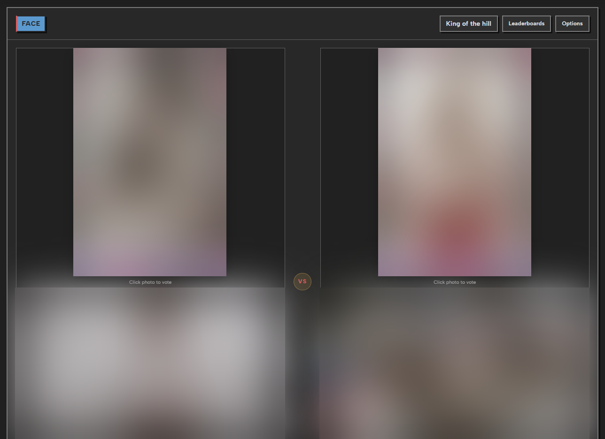
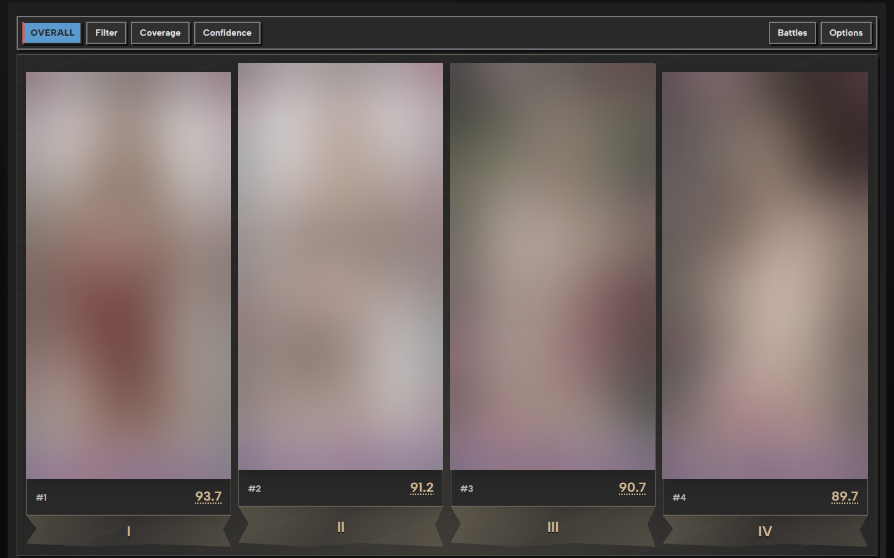
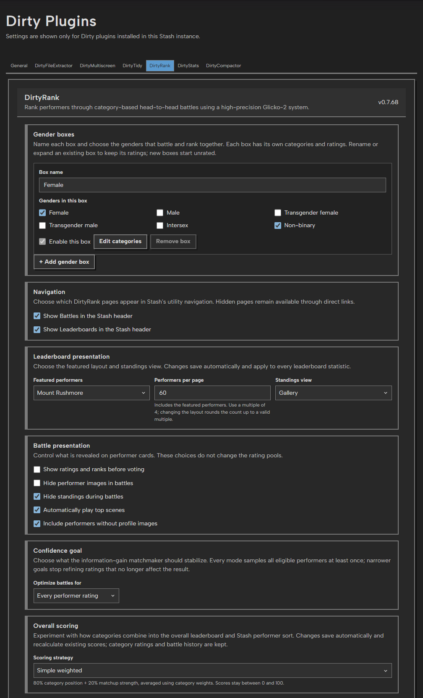

# DirtyRank

DirtyRank ranks Stash performers through head-to-head battles. It uses Glicko-2,
so every category and performer cohort tracks a rating, rating deviation, and
volatility instead of relying on a capped integer score.

## Features

- Standings gallery and podium use Stash's native performer cards, so installed
  themes and performer-card customizations apply automatically. DirtyRank scores
  and ranks appear separately below the cards; the cards keep their Stash ratings.
- Battle, leaderboard, and settings controls use the shared DirtyPlugins style
  primitives. Native performer cards and the native scene player keep their Stash
  styling and behaviour as themes change.
- Battles and Gauntlet also use native cards. Click the photo to vote; native
  card buttons and profile links keep their normal actions. Scene players remain
  separate below the cards. Hiding performer images also hides the native card.

- Named **gender boxes**, each with a selectable group of genders and its own
  categories. For example, create Box 1 for Female + Non-binary, Box 2 for Male,
  and Box 3 for Transgender female + Transgender male. A **Gender box** selector
  on battles and leaderboards switches the entire participant and category set.
  Gauntlet offers only boxes that include its target; King of the hill uses the
  selected box as well. URLs preserve box selection.
- The battle page remembers the explicitly selected category for each box,
  including across page reloads, and changes it only if that category is
  disabled or removed.
- Existing per-sex groups become boxes with the same storage IDs, categories,
  ratings, and history. Rename them and change their genders in **Gender boxes**,
  or add new boxes. New boxes and members new to a pool start unrated; ratings
  from other boxes are independent and are not automatically merged. Removing a
  gender or disabling a box hides its performers without deleting their ratings.
  Select the gender or enable the box again to restore their standings.
- Every box starts with Appearance and Performance categories.
  Category IDs and bookmarkable leaderboard URLs follow the category label;
  matching sanitized labels receive `-1`, `-2`, and so on. Renaming a category
  keeps its ratings and battle history.
  Categories have a weight. Choose **Simple weighted** (the original calculation)
  or **Power mean** in settings. Both score from 0 to 100 and use only enabled
  categories that include the performer's gender. Category Glicko-2 ratings
  and battle history stay unchanged.
- High-precision ratings with no normal upper ceiling; the default starting
  rating is 1000.
- Configurable evidence per battle defaults to 2.0, reflecting that subjective
  comparisons are expected to be more repeatable than a chess result. It
  doubles the Glicko-2 information contribution without duplicating match totals.
- Provisional ratings based on rating deviation. Inactivity does not alter a
  performer's rating or uncertainty.
- Expected-information-gain matchmaking that predicts each candidate battle's
  Glicko-2 uncertainty reduction, applies soft recent-pair and calibration
  penalties, and advances the selected confidence goal as efficiently as possible.
- Selectable confidence goals for every performer rating, complete leaderboard
  order, or a configurable top N. Leaderboard modes stop refining performers
  once they no longer affect the requested ordering.
- Distinct **Tie** and **Skip** actions. A tie is rated; a skip does not change
  either performer.
- Each battle card can load media on demand. It prefers a curated marker from
  the performer's highest-rated scene that has markers, then falls back to the
  performer's highest-rated full Stash scene.
- Enable **Automatically play top scenes** under **Battle presentation** to
  open each performer's highest-rated full scene when a battle starts, including
  Gauntlet battles. This setting is off by default; when off, media is requested
  only when the play button is used.
- Full scenes start at a fresh random point between 30% and 70% of their duration.
  Curated markers retain their original start/end bounds. Previews start muted;
  use the player controls to enable sound or resume if the browser blocks playback.
- Previews appear in separate panels below the photos. Photos stay visible and
  clickable for voting unless explicitly hidden in settings. Player controls
  do not cast votes, and each preview can be closed independently.
- Converted streams use Stash's native scene player for the full duration and
  seeking throughout the scene, including formats such as WMV.
- Automatic previews wait briefly for a battle to settle before loading. Leaving
  a battle or closing a preview cancels its metadata request and releases its
  video stream, so rapid choices do not leave old downloads running.
- Performer images can be hidden from battle cards without changing which
  performers are eligible for the pool.
- Performer names on battle cards open their Stash performer pages. Every new
  battle animates the cards and fades images in after loading, even when a
  performer or image repeats, so the change remains unambiguous. In Gauntlet,
  the left target card stays in place across votes, skips, and undo, keeping
  its current video playing while only the right challenger card refreshes.
- Click **King of the hill** on the standard battle page to keep each winner on the
  same side against a fresh challenger. The opening match starts among the
  lowest-ranked performers, with unrated performers going first. Each new
  challenger comes from the next few available ranks, so the winner climbs
  the current standings with some variation. The winner's card remains mounted,
  so an open scene keeps playing. Defeated performers do not return during the
  run; when every eligible challenger has lost, the hill ends and offers a new
  run with the winning card centered, rising rockets, layered fireworks, a
  six-burst finale, and falling confetti. The celebration finishes automatically
  and respects reduced-motion preferences. This mode hides the right-hand
  leaderboard and expands the battle area; **Standard battles** returns to the
  standard layout. The mode has an ink, burgundy, and gold palette, a crown crest in the header,
  a gold **Reigning champion** banner that follows the winner, rose challenger
  banners, and a compact counter showing progress through the run. The opening
  pair are **Contenders**; the final winner is labelled **Hill conquered**.
  These decorations sit outside the native cards and players.
  The hill changes the battle flow independently of the confidence goal in
  settings; Tie and Skip are unavailable in this mode. Undo restores the last
  defeated challenger.
- DirtyRank prepares the next information-gain matchup during browser idle time
  and preloads both profile images, making decisions advance immediately while
  preserving the full matchmaking search.
- **Gauntlet** mode focuses every battle on one performer and chooses the
  opponent that provides the most information about that performer's current
  category rating. Launch it with **Start Gauntlet** on any Stash performer
  page. Its target confidence bar shows progress toward Refined and Excellent
  rating precision, with an estimate of the remaining battles.
- Battles advance immediately while votes are persisted through an ordered
  background queue; pending writes and failures remain visible in the UI.
- While votes or undos remain queued, DirtyRank blocks in-app navigation and
  asks for confirmation before browser reload, tab close, or window close. The
  guard disappears automatically when all background operations finish.
- The last winner and loser remain visible in green and red while the next pair
  is already available; ties use an amber result treatment.
- Standard battle headers keep only the DirtyRank title and controls; Gauntlet
  retains its target confidence bar. Category confidence details remain
  available on the Leaderboards page.
- **Hide standings during battles** in Battle presentation hides the right-hand
  standings and widens standard and Gauntlet battles. King of the hill always
  hides standings, regardless of this setting. Changes save automatically.
- Standard and hill battles show how many eligible performers in the selected
  category and sex still need refinement, with an estimate to refine the whole
  cohort. The estimate assumes informative matchups and hides when all eligible
  performers are Refined or Excellent; it is independent of the matchmaking goal.
- Each battle category has a bookmarkable URL: `/plugins/dirty-rank/category/<id>`
  for standard battles and `/plugins/dirty-rank/category/<id>/king-of-the-hill`
  for hill mode. Category and mode buttons update the URL; reloading or browser
  Back restores that category and mode. Gauntlet categories use
  `/plugins/dirty-rank/gauntlet/<performerId>/<categoryId>`. The original Battles
  and Gauntlet links open the remembered category and redirect to its URL.
- A dedicated **Leaderboards** page covers every gender box, each enabled
  category, and the weighted overall score. Choose **Podium** (the default
  gold/silver/bronze steps), **Mount Rushmore**, or **Fingers** to feature your
  leading performers. Choose this and the Gallery or Table standings view once
  in DirtyRank's Leaderboard presentation settings; both save automatically.
  **Performers per page** includes the featured top and the standings underneath,
  in either view. Use a multiple of 3 for Podium, 4 for Mount Rushmore, or 5 for
  Fingers, with a minimum of two rows. Changing the layout rounds the count up
  to a valid multiple (up to 1000). The default is 18, adjusted for the layout.
  Gallery columns match the selected layout on wide screens, with tight gaps
  and padding to give each performer card more room. Filters hide the
  featured top and use the full performer count for their results.
  Coverage and Confidence open compact toolbar popovers without adding rows
  or moving the standings. Each statistic has its own bookmarkable leaderboard URL. Stash's native
  performer filters narrow the displayed results while ratings, summary
  statistics, and rank numbers remain global. Hover an Overall score in the
  featured cards, gallery, or table to see each category's leaderboard position
  followed by its rating in parentheses, and rated-category coverage. Mount Rushmore
  keeps its carved-stone bases; Fingers arranges its numbered columns as
  **1–2–3–4–5**, with each successive column slightly shorter. Mount Rushmore
  and Fingers stretch their portraits taller to fill the extra room. Cards show
  rank and score on one line, with no score label or `/100` suffix. An asterisk
  marks results that still need comparisons; refined and excellent results have
  no marker. Gallery and table standings have no decorative panel headers.
  Win/loss records are hidden. Smaller screens show the Fingers cards in rank order;
  the remaining gallery or table starts at the next rank. Search finds any rated
  performer by name, including those featured above, and keeps their overall
  rank in the results. Full standings,
  confidence, rated coverage, stable-rating coverage, completed battles, median
  RD, draw rate, and rating spread are also included.
- Separate **Show Battles in the Stash header** and **Show Leaderboards in the
  Stash header** switches control the two utility navigation buttons. Both are
  enabled by default and save automatically; hidden pages remain accessible by
  direct link.
- Up to 25 consecutive session undos, arrow-key battle controls (← left,
  → right, ↑ tie, ↓ undo), responsive performer cards, and a
  weighted overall leaderboard. Undo restores the previous pair immediately
  and queues its database reversal behind pending votes; repeated Undo presses
  synchronously consume the history in LIFO order. The button reports the
  remaining depth.
- An **Overall score** option in Stash's performer sort menu. It respects the
  current performer filters and page size, supports both directions, calculates
  each performer's weighted score from the default box when eligible, otherwise
  the first eligible enabled box, and
  keeps performers without a DirtyRank result at the end.
- A **Reset ratings** button on each category in settings. Its confirmation names
  the gender box and category; resetting clears only that pool's ratings and
  battle history. Reset buttons wait for pending settings to finish saving.
  Full database backups are available in shared Dirty Plugins settings.

## Overall scoring

Choose **Settings → DirtyRank → Overall scoring → Scoring strategy** to
experiment. Switching strategies or adjusting their parameters automatically
recalculates the Overall leaderboard and Stash's Overall score performer sort.
It does not change category ratings, battle history, or matchmaking.

| Strategy | Calculation | Defaults | Range |
| --- | --- | --- | --- |
| Simple weighted | Weighted average of 0.8 × position + 0.2 × strength | Original behavior | 0–100 |
| Power mean | (weighted average of category scores raised to p) raised to 1/p | Power 3; adjustable from 1 to 4 | 0–100 |

Hover an overall score to see the strategy, category ranks, and category scores.

Power mean changes only how the category scores are combined. Power 1
matches Simple weighted exactly; power 2 mildly emphasizes strengths; power 3
is the suggested starting point; power 4 emphasizes them more. Decimal powers
are supported. All enabled categories retain their weights, and missing
categories contribute 50. A single category retains its original score.

For both strategies, compare the performer with all other rated performers
in the same performer-sex cohort. Percentile position awards 100 to first place
and 0 to last place, with ties sharing their average position. Matchup strength
is the average rating-only expected score against those same performers:
`1 / (1 + exp((opponentRating - rating) / 173.7178))`, multiplied by 100. This
uses rating differences, counts draws as half, and deliberately keeps rating
deviation separate as a confidence measure.

The category contribution is `0.8 * position + 0.2 * strength`. Overall score
with Simple weighted is the weighted average of these contributions. A larger
rating advantage increases matchup strength towards its ceiling, so a category with extreme
ratings cannot gain unlimited influence. At the same percentile position,
strength can change the category contribution by at most 20 points before
applying its overall weight.

An unrated category contributes a neutral 50 and keeps the overall result
provisional. A category with only one rated performer also contributes 50
because there are no opponents for comparison. Fully tied pools score 50.
Performers with no rated categories remain outside the overall leaderboard
and at the end of the native performer sort in either direction.

Normalization uses the full cohort, including rated performers without images;
page filters and pagination only change what is displayed. Deleted performers
and rating pools left over from another gender box are excluded when the
performer list is refreshed. Scores are cached and recalculated after rating,
undo, reset, or reference-population updates. The displayed score uses one
decimal place, while ordering uses full precision. Overall confidence and RD
describe the underlying category ratings, rather than uncertainty in the
normalized score.

## Screenshots

For safe documentation views, append `?docsCapture=1` to either DirtyRank page.
The older `?censorMedia=1` URL remains supported. Capture mode hides media,
including media inside native Stash cards and players; inspect any image before
adding it to repository documentation.

### Performer battles

A standard battle with **Hide standings during battles** and **Automatically
play top scenes** enabled: click a native performer card's photo to vote, while
each top scene plays in its own panel below. Photos and video are blurred for
the repository.

### Leaderboards

The Overall leaderboard with the Mount Rushmore display. Filter, Coverage, and
Confidence stay in the toolbar; the gallery or table standings continue below.

### Settings

Configure gender boxes, navigation buttons, leaderboard and battle
presentation, the confidence goal, and overall scoring from the shared hub.
Rating categories, resets, and advanced Glicko-2 parameters follow below.

## Data and compatibility

DirtyRank stores its high-precision pools and battle journal in the shared
`dirty_plugins.sqlite3` database owned by DirtyPlugins. It does not change
performer custom fields or Stash's native `rating100`, so saving a battle does
not trigger performer-update hooks and it can run alongside Advanced Rating.

Each pool stores its unrounded rating, deviation, volatility, result counts,
and recent idempotency IDs. Every battle writes both performer pools and its
undo snapshots in one independent SQLite transaction. The database uses WAL
mode, and the Options backup action safely snapshots all Dirty-plugin tables.

## Installation

Install DirtyRank from the Dirty Plugins package source, or copy both the
`DirtyRank` and sibling `DirtyPlugins` directories into the Stash plugins
directory and reload plugins.

Open **Settings → Plugins → DirtyRank → Open Dirty Plugins settings** to choose
the default gender box and configure categories. Under **Gender boxes**, name
each box and use **Genders in this box** to choose its participants. Use
**Edit categories** to define that box's categories. Changes save automatically.
Launch battles with the
crossed-swords button in Stash's utility navigation, then use **Leaderboards**
on the battle page to inspect every category set.

## Rating presets

Open **Advanced configuration** in DirtyRank settings for four presets. Selecting
one updates all its parameters in a single automatic save. Manual changes show
**Custom configuration**; unrelated settings, gender boxes, ratings, and battle
history are retained. Matching values highlight their preset; opening the page
does not apply a preset or change existing values.
The green **Current** button restores the advanced parameters loaded when this
settings page was opened, even after presets have saved. Other settings are kept.
It stays available during automatic saves; an older save cannot overwrite the
restored values.
The estimate beside the presets updates immediately as you change parameters or
the gender box selected under **Rating categories**. It projects a fresh category
until every eligible performer reaches Refined, with each battle refining two
performers. Existing category ratings are excluded. It assumes informative close
matchups, so calibration, repeat avoidance, tau, and a common starting-rating
offset need not change this rounded estimate; actual results can change the total.
An `≥` marks the model's 1000-battles-per-performer limit. Loading failures show
an unavailable estimate rather than a fabricated performer count.

| Preset | Evidence per battle | Recent pairs to avoid | Calibration | Tau |
| --- | ---: | ---: | ---: | ---: |
| Default | 2× | 12 | 10% | 0.5 |
| Chess | 1× | 12 | 10% | 0.75 |
| Confident | 2× | 24 | 5% | 0.5 |
| Extremely confident | 3× | 48 | 0% | 0.3 |

**Default** restores the original DirtyRank parameters from before these presets
were added: initial rating 1000, deviation 350, volatility 0.06, floor 30, and
refinement threshold 100, along with the values in the table. Unlike **Current**,
it always restores this baseline rather than the page-opening snapshot.

**Chess** uses Lichess's core values: initial rating 1500, initial deviation 500,
initial volatility 0.09, deviation floor 45, and provisional threshold 110.
These come from [Lichess's rating configuration](https://github.com/lichess-org/lila/blob/master/modules/rating/src/main/Glicko.scala)
and [ScalaChess's tau and provisional constants](https://github.com/lichess-org/scalachess/blob/master/rating/src/main/scala/glicko/model.scala).
This is a baseline for DirtyRank, not a complete replica of Lichess: DirtyRank
keeps one battle per rating period and no inactivity inflation or chess colour
advantage. Repeat avoidance and calibration are DirtyRank matchmaking controls.

**Confident** and **Extremely confident** retain DirtyRank's starting values
(1000, deviation 350, volatility 0.06), floor 30, and refinement threshold 100.
Higher evidence weight reduces uncertainty faster while counting each vote as
one battle. Lower calibration favours informative close comparisons; longer
repeat windows discourage reusing pairs. Both remain soft preferences, so small
pools can still repeat pairs. These controls affect standard and Gauntlet
matchmaking; King of the hill keeps its climb through the standings.

Tau controls changes in volatility, not the strength of each vote. The smaller
values restrain volatility drift when preferences are stable, within the range
described in [Glickman's Glicko-2 specification](https://www.glicko.net/glicko/glicko2.pdf).
Extremely confident gives mistaken votes more weight as well. These are
practical presets for consistent subjective choices, not parameters fitted to
your battle history or a guarantee of fewer battles for every outcome sequence.

In a deterministic backend check with two initially unrated, equal-strength
performers alternating wins, Chess reached its refinement threshold after 17
battles, Confident after 10, and Extremely confident after 9. Real totals depend
on opponent uncertainty, results, pool size, and the selected confidence goal.
Only future updates use the new parameters. Existing ratings are not recalculated;
starting values apply to unrated performers. Reset a pool explicitly if you want
every performer to start together with a different baseline.

## Defaults

- Initial rating: 1000
- Initial deviation: 350
- Initial volatility: 0.06
- Evidence per battle: 2.0
- Tau: 0.5
- Deviation floor: 30
- Provisional threshold: 100
- Confidence goal: leaderboard order
- Top-N size: 20
- Hide performer images in battles: disabled
- Enabled gender boxes: Female by default; existing per-sex selections are retained
- Show Leaderboards in the navigation menu: enabled

The backend keeps floating-point precision. The interface rounds ratings only
for display.

## License

DirtyRank is distributed under the [MIT License](LICENSE).
